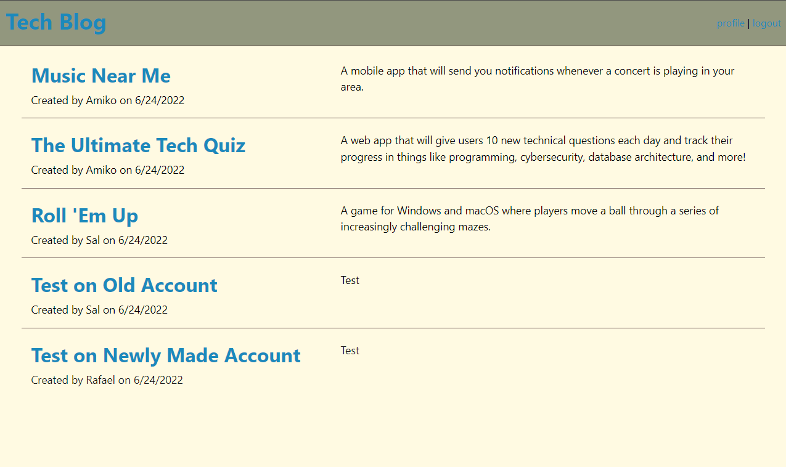

## Tech-Blog
  
  
 
  ## Table of Contents
  - [Description](#description)
  - [Installation](#nstallation)
  - [Contributors](#contributors)
  - [Usage](#usage)
  - [Tests](#tests)
  - [Questions](#questions)

  ## Description
  A tech blog website that allows user to make an account. After and account gets made, user can view all blog post and make their own, user can only delete their own. User can log out and log back in with their own credentials.

  ## Installation
  npm i for all dependcies 

  ## Contributors
  Email me if you would like to contribute

  ## Usage
  For users who want to post and read about tech and coding. A user that wants to connect to a community. 

  ## Tests
  None 

  ## Questions
  - GitHub: RafaelH731
  - Email: rafaelherrera731@gmail.com
  - https://young-taiga-11060.herokuapp.com/
  
  ## Screenshots
  - 
  

